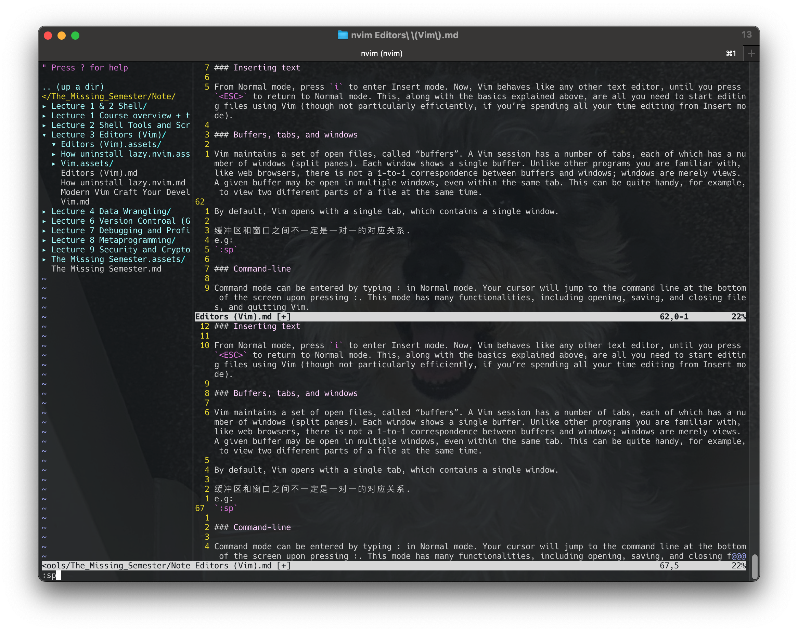

# Editors (Vim)

I use neovim as vim to finish some parts of this lecture, the neovim almost same as vim. The configuration a little different.

https://youtu.be/a6Q8Na575qc

Writing English words and writing code are very different activities. When programming, you spend more time switching files, reading, navigating, and editing code compared to writing a long stream. It makes sense that there are different types of programs for writing English words versus code (e.g. Microsoft Word versus Visual Studio Code).

> 写作和写代码其实是两项非常不同的活动。当我们编程的时候，会经常在文件间进行切换、阅读、浏览和修改代码，而不是连续编写一大段的文字。因此代码编辑器和文本编辑器是很不同的两种工具（例如微软的 Word 与 Visual Studio Code）。

As programmers, we spend most of our time editing code, so it’s worth investing time mastering an editor that fits your needs. Here’s how you learn a new editor:

> 作为程序员，我们大部分时间都花在代码编辑上，所以花点时间掌握某个适合自己的编辑器是非常值得的。通常学习使用一个新的编辑器包含以下步骤：

* Start with a tutorial (i.e. this lecture, plus resources that we point out)
* Stick with using the editor for all your text editing needs (even if it slows you down initially)
* Look things up as you go: if it seems like there should be a better way to do something, there probably is

> - 阅读教程（比如这节课以及我们为您提供的资源）
> - 坚持使用它来完成你所有的编辑工作（即使一开始这会让你的工作效率降低）
> - 随时查阅：如果某个操作看起来像是有更方便的实现方法，一般情况下真的会有

If you follow the above method, fully committing to using the new program for all text editing purposes, the timeline for learning a sophisticated text editor looks like this. In an hour or two, you’ll learn basic editor functions such as opening and editing files, save/quit, and navigating buffers. Once you’re 20 hours in, you should be as fast as you were with your old editor. After that, the benefits start: you will have enough knowledge and muscle memory that using the new editor saves you time. Modern text editors are fancy and powerful tools, so the learning never stops: you’ll get even faster as you learn more.

> 如果您能够遵循上述步骤，并且坚持使用新的编辑器完成您所有的文本编辑任务，那么学习一个复杂的代码编辑器的过程一般是这样的：头两个小时，您会学习到编辑器的基本操作，例如打开和编辑文件、保存与退出、浏览缓冲区。当学习时间累计达到20个小时之后，您使用新编辑器的效率应该已经和使用老编辑器一样快。在此之后，其益处开始显现：有了足够的知识和肌肉记忆后，使用新编辑器将大大节省你的时间。而现代文本编辑器都是些复杂且强大的工具，永远有新东西可学：学的越多，效率越高。

## Which editor to learn?

Programmers have [strong opinions](https://en.wikipedia.org/wiki/Editor_war) about their text editors.

> 程序员们对自己正在使用的文本编辑器通常有着 [非常强的执念](https://zh.wikipedia.org/wiki/编辑器之战)。

Which editors are popular today? See this Stack Overflow survey (there may be some bias because Stack Overflow users may not be representative of programmers as a whole). Visual Studio Code is the most popular editor. Vim is the most popular command-line-based editor.

> 现在最流行的编辑器是什么？[Stack Overflow 的调查](https://insights.stackoverflow.com/survey/2019/#development-environments-and-tools)（这个调查可能并不如我们想象的那样客观，因为 Stack Overflow 的用户并不能代表所有程序员）显示，[Visual Studio Code](https://code.visualstudio.com/) 是目前最流行的代码编辑器。而 [Vim](https://www.vim.org/) 则是最流行的基于命令行的编辑器。

### Vim

All the instructors of this class use Vim as their editor. Vim has a rich history; it originated from the Vi editor (1976), and it’s still being developed today. Vim has some really neat ideas behind it, and for this reason, lots of tools support a Vim emulation mode (for example, 1.4 million people have installed [Vim emulation for VS code](https://github.com/VSCodeVim/Vim). Vim is probably worth learning even if you finally end up switching to some other text editor.

> 这门课的所有教员都使用 Vim 作为编辑器。Vim 有着悠久历史；它始于 1976 年的 Vi 编辑器，到现在还在 不断开发中。Vim 有很多聪明的设计思想，所以很多其他工具也支持 Vim 模式（比如，140 万人安装了 [Vim emulation for VS code](https://github.com/VSCodeVim/Vim)）。即使你最后使用 其他编辑器，Vim 也值得学习。

It’s not possible to teach all of Vim’s functionality in 50 minutes, so we’re going to focus on explaining the philosophy of Vim, teaching you the basics, showing you some of the more advanced functionality, and giving you the resources to master the tool.

> 由于不可能在 50 分钟内教授 Vim 的所有功能，我们会专注于解释 Vim 的设计哲学，教你基础知识， 并展示一部分高级功能，然后给你掌握这个工具所需要的资源。

## Philosophy of Vim

When programming, you spend most of your time reading/editing, not writing. For this reason, Vim is a modal editor: it has different modes for inserting text vs manipulating text. Vim is programmable (with Vimscript and also other languages like Python), and Vim’s interface itself is a programming language: keystrokes (with mnemonic names) are commands, and these commands are composable. Vim avoids the use of the mouse, because it’s too slow; Vim even avoids using the arrow keys because it requires too much movement.

> 在编程的时候，你会把大量时间花在阅读/编辑而不是在写代码上。所以，Vim 是一个*多模态*编辑器：它对于插入文字和操纵文字有不同的模式。Vim 是可编程的（可以使用 Vimscript 或者像 Python 一样的其他程序语言），Vim 的接口本身也是一个程序语言：键入操作（以及其助记名） 是命令，这些命令也是可组合的。Vim 避免了使用鼠标，因为那样太慢了；Vim 甚至避免用 上下左右键因为那样需要太多的手指移动。

The end result is an editor that can match the speed at which you think.

> 这样的设计哲学使得 Vim 成为了一个能跟上你思维速度的编辑器。

## Modal editing

Vim’s design is based on the idea that a lot of programmer time is spent reading, navigating, and making small edits, as opposed to writing long streams of text. For this reason, Vim has multiple operating modes.

> Vim 的设计以大多数时间都花在阅读、浏览和进行少量编辑改动为基础，因此它具有多种操作模式：

- `Normal`: for moving around a file and making edits
- `Insert`: for inserting text
- `Replace`: for replacing text
- `Visual` (plain, line, or block): for selecting blocks of text
- `Command-line`: for running a command

> - **正常模式**：在文件中四处移动光标进行修改
> - **插入模式**：插入文本
> - **替换模式**：替换文本
> - **可视化模式**（一般，行，块）：选中文本块
> - **命令模式**：用于执行命令

Keystrokes have different meanings in different operating modes. For example, the letter `x` in Insert mode will just insert a literal character `x`, but in Normal mode, it will delete the character under the cursor, and in Visual mode, it will delete the selection.

> 在不同的操作模式下，键盘敲击的含义也不同。比如，`x` 在插入模式会插入字母 `x`，但是在正常模式 会删除当前光标所在的字母，在可视模式下则会删除选中文块。

In its default configuration, Vim shows the current mode in the bottom left. The initial/default mode is Normal mode. You’ll generally spend most of your time between Normal mode and Insert mode.

> 在默认设置下，Vim 会在左下角显示当前的模式。Vim 启动时的默认模式是正常模式。通常你会把大部分 时间花在正常模式和插入模式。

You change modes by pressing `<ESC>` (the escape key) to switch from any mode back to Normal mode. From Normal mode, enter Insert mode with `i`, Replace mode with `R`, Visual mode with `v`, Visual Line mode with `V`, Visual Block mode with `<C-v>` (Ctrl-V, sometimes also written `^V`), and Command-line mode with `:`.

> 你可以按下 `<ESC>`（退出键）从任何其他模式返回正常模式。在正常模式，键入 `i` 进入插入 模式，`R` 进入替换模式，`v` 进入可视（一般）模式，`V` 进入可视（行）模式，`<C-v>` （Ctrl-V, 有时也写作 `^V`）进入可视（块）模式，`:` 进入命令模式。

You use the `<ESC>` key a lot when using Vim: consider remapping Caps Lock to Escape ([macOS instructions](https://vim.fandom.com/wiki/Map_caps_lock_to_escape_in_macOS)).

> 因为你会在使用 Vim 时大量使用 `<ESC>` 键，所以可以考虑把大小写锁定键重定义成 `<ESC>` 键（[MacOS 教程](https://vim.fandom.com/wiki/Map_caps_lock_to_escape_in_macOS)）。

## Basics

### Inserting text

From Normal mode, press `i` to enter Insert mode. Now, Vim behaves like any other text editor, until you press `<ESC>` to return to Normal mode. This, along with the basics explained above, are all you need to start editing files using Vim (though not particularly efficiently, if you’re spending all your time editing from Insert mode).

> 在正常模式，键入 `i` 进入插入模式。现在 Vim 跟很多其他的编辑器一样，直到你键入 `<ESC>` 返回正常模式。你只需要掌握这一点和上面介绍的所有基础知识就可以使用 Vim 来编辑文件了 （虽然如果你一直停留在插入模式内不一定高效）。

### Buffers, tabs, and windows

Vim maintains a set of open files, called “buffers”. A Vim session has a number of tabs, each of which has a number of windows (split panes). Each window shows a single buffer. Unlike other programs you are familiar with, like web browsers, there is not a 1-to-1 correspondence between buffers and windows; windows are merely views. A given buffer may be open in multiple windows, even within the same tab. This can be quite handy, for example, to view two different parts of a file at the same time.

> Vim 会维护一系列打开的文件，称为“缓存”。一个 Vim 会话包含一系列标签页，每个标签页包含 一系列窗口（分隔面板）。每个窗口显示一个缓存。跟网页浏览器等其他你熟悉的程序不一样的是， 缓存和窗口不是一一对应的关系；窗口只是视角。一个缓存可以在*多个*窗口打开，甚至在同一 个标签页内的多个窗口打开。这个功能其实很好用，比如在查看同一个文件的不同部分的时候。

By default, Vim opens with a single tab, which contains a single window.

> Vim 默认打开一个标签页，这个标签也包含一个窗口。

缓冲区和窗口之间不一定是一对一的对应关系.
e.g:
`:sp`: 分成了两个窗口, 如果在一个窗口编辑, 实际上也会同步到下面的窗口中, 因为两个窗口打开的是同一个缓冲区, 这对于同时查看一个文件不同的两个部分非常有用, 比如能够在文件的顶部查看包的导入,同时在下面的窗口对程序其他地方进行一些修改.
`^Wj`: 跳转到下面的窗口
`^Wk`: 跳转到上面的窗口


Vim有一种理念: 有几个标签页(tab), 每个tab有一些窗口, 然后每个窗口对应一个缓冲区(buffer), 而一个缓冲区可以在零个或多个窗口中同时打开.
`qa`: (quit all) 来关闭所有打开的窗口.
Vim 本身就是一种基于命令的编程语言

### Command-line

Command mode can be entered by typing `:` in Normal mode. Your cursor will jump to the command line at the bottom of the screen upon pressing `:`. This mode has many functionalities, including opening, saving, and closing files, and [quitting Vim](https://twitter.com/iamdevloper/status/435555976687923200).

> 在正常模式下键入 `:` 进入命令行模式。 在键入 `:` 后，你的光标会立即跳到屏幕下方的命令行。 这个模式有很多功能，包括打开，保存，关闭文件，以及 [退出 Vim](https://twitter.com/iamdevloper/status/435555976687923200)。

* `:q` quit (close window)
* `:w` save (“write”)
* `:wq` save and quit
* `:e {name of file}` open file for editing
* `:ls` show open buffers
* `:help {topic}` open help
    * `:help :w` opens help for the `:w` command
* `:help w` opens help for the `w` movement

> - `:q` 退出（关闭窗口）
> - `:w` 保存（写）
> - `:wq` 保存然后退出
> - `:e {文件名}` 打开要编辑的文件
> - `:ls` 显示打开的缓存
> - `:help {标题}` 打开帮助文档
>   - `:help :w` 打开 `:w` 命令的帮助文档
>   - `:help w` 打开 `w` 移动的帮助文档

## Vim’s interface is a programming language

The most important idea in Vim is that Vim’s interface itself is a programming language. Keystrokes (with mnemonic names) are commands, and these commands compose. This enables efficient movement and edits, especially once the commands become muscle memory.

> Vim 最重要的设计思想是 Vim 的界面本身是一个程序语言。键入操作（以及他们的助记名） 本身是命令，这些命令可以组合使用。这使得移动和编辑更加高效，特别是一旦形成肌肉记忆。

### Movement

You should spend most of your time in Normal mode, using movement commands to navigate the buffer. Movements in Vim are also called “nouns”, because they refer to chunks of text.

> 多数时候你会在正常模式下，使用移动命令在缓存中导航。在 Vim 里面移动也被称为 “名词”， 因为它们指向文字块。

* Basic movement: `hjkl` (left, down, up, right)
* Words: `w` (next word), `b` (beginning of word), `e` (end of word)
* Lines: `0` (beginning of line), `^` (first non-blank character), `$` (end of line)
* Screen: `H` (top of screen), `M` (middle of screen), `L` (bottom of screen)
* Scroll: `Ctrl-u` (up), `Ctrl-d` (down)
* File: `gg` (beginning of file), `G` (end of file)
* Line numbers: `:{number}<CR>` or `{number}G` (line {number})
* Misc: `%` (corresponding item)
* Find: `f{character}`, t{character}, F{character}, T{character}
    * find/to forward/backward {character} on the current line
    * `,` / `;` for navigating matches
    * Search: `/{regex}`, `n` / `N` for navigating matches

> - 基本移动: `hjkl` （左， 下， 上， 右）
> - 词： `w` （下一个词）， `b` （词初）， `e` （词尾）
> - 行： `0` （行初）， `^` （第一个非空格字符）， `$` （行尾）
> - 屏幕： `H` （屏幕首行）， `M` （屏幕中间）， `L` （屏幕底部）
> - 翻页： `Ctrl-u` （上翻）， `Ctrl-d` （下翻）
> - 文件： `gg` （文件头）， `G` （文件尾）
> - 行数： `:{行数}<CR>` 或者 `{行数}G` ({行数}为行数)
> - 杂项： `%` （找到配对，比如括号或者 /* */ 之类的注释对）
> - 查找：`f{字符}`,  `t{字符}`，`F{字符}`，`T{字符}`
>   - 查找/到 向前/向后 在本行的{字符}
>   - `,` / `;` 用于导航匹配
> - 搜索: `/{正则表达式}`, `n` / `N` 用于导航匹配


### Selection

Visual modes:

* Visual: `v`
* Visual Line: `V`
* Visual Block: `Ctrl-v`

Can use movement keys to make selection.

> 可视化模式:
>
> - 可视化：`v`
> - 可视化行： `V`
> - 可视化块：`Ctrl+v`
>
> 可以用移动命令来选中。


### Edits

Everything that you used to do with the mouse, you now do with the keyboard using editing commands that compose with movement commands. Here’s where Vim’s interface starts to look like a programming language. Vim’s editing commands are also called “verbs”, because verbs act on nouns.

> 所有你需要用鼠标做的事， 你现在都可以用键盘：采用编辑命令和移动命令的组合来完成。 这就是 Vim 的界面开始看起来像一个程序语言的时候。Vim 的编辑命令也被称为 “动词”， 因为动词可以施动于名词。

* `i` enter Insert mode
    * but for manipulating/deleting text, want to use something more than backspace
* `o` / `O` insert line below / above
* `d{motion}` delete {motion}
* e.g. `dw` is delete word, `d$` is delete to end of line, `d0` is delete to beginning of line
* `c{motion}` change {motion}
    * e.g. `cw` is change word
    * like `d{motion}` followed by i
* `x` delete character (equal do dl)
* `s` substitute character (equal to cl)
* Visual mode + manipulation
    * select text, `d` to delete it or `c` to change it
* `u` to undo, `<C-r>` to redo
* `y` to copy / “yank” (some other commands like d also copy)
* `p` to paste
* Lots more to learn: e.g. `~` flips the case of a character

> - `i`进入插入模式
>
>   - 但是对于操纵/编辑文本，不单想用退格键完成
>
> - `O` / `o` 在之上/之下插入行
>
> - `d{移动命令}`删除 {移动命令}
>
>   - 例如，`dw` 删除词, `d$` 删除到行尾, `d0` 删除到行头。
>
> - `c{移动命令}`
>
>   改变 {移动命令}
>
>   - 例如，`cw` 改变词
>   - 比如 `d{移动命令}` 再 `i`
>
> - `x` 删除字符（等同于 `dl`）
>
> - `s` 替换字符（等同于 `xi`）
>
> - 可视化模式 + 操作
>
>   - 选中文字, `d` 删除 或者 `c` 改变
>
> - `u` 撤销, `<C-r>` 重做
>
> - `y` 复制 / “yank” （其他一些命令比如 `d` 也会复制）
>
> - `p` 粘贴
>
> - 更多值得学习的: 比如 `~` 改变字符的大小写


### Counts

You can combine nouns and verbs with a count, which will perform a given action a number of times.

> 你可以用一个计数来结合“名词”和“动词”，这会执行指定操作若干次。

* `3w` move 3 words forward
* `5j` move 5 lines down
* `7dw` delete 7 words

> - `3w` 向后移动三个词
> - `5j` 向下移动5行
> - `7dw` 删除7个词

### Modifiers

You can use modifiers to change the meaning of a noun. Some modifiers are i, which means “inner” or “inside”, and `a`, which means “around”.

> 你可以用修饰语改变“名词”的意义。修饰语有 `i`，表示“内部”或者“在内”，和 `a`， 表示“周围”。

* `ci(` change the contents inside the current pair of parentheses
* `ci[` change the contents inside the current pair of square brackets
* `da'` delete a single-quoted string, including the surrounding single quotes

> - `ci(` 改变当前括号内的内容
> - `ci[` 改变当前方括号内的内容
> - `da'` 删除一个单引号字符串， 包括周围的单引号

## Demo

Here is a broken [fizz buzz](https://en.wikipedia.org/wiki/Fizz_buzz) implementation:
```python
def fizz_buzz(limit):
    for i in range(limit):
        if i % 3 == 0:
            print('fizz')
        if i % 5 == 0:
            print('fizz')
        if i % 3 and i % 5:
            print(i)

def main():
    fizz_buzz(10)
```

We will fix the following issues:

* Main is never called
* Starts at 0 instead of 1
* Prints “fizz” and “buzz” on separate lines for multiples of 15
* Prints “fizz” for multiples of 5
* Uses a hard-coded argument of 10 instead of taking a command-line argument

See the lecture video for the demonstration. Compare how the above changes are made using Vim to how you might make the same edits using another program. Notice how very few keystrokes are required in Vim, allowing you to edit at the speed you think.


## Customizing Vim

Vim is customized through a plain-text configuration file in `~/.vimrc` (containing Vimscript commands). There are probably lots of basic settings that you want to turn on.

> Vim 由一个位于 `~/.vimrc` 的文本配置文件（包含 Vim 脚本命令）。你可能会启用很多基本设置。
>
> > nvim对应的配置文件为/Users/eve/.config/nvim/init.vim, 如果没有需要创建. 

We are providing a well-documented basic config that you can use as a starting point. We recommend using this because it fixes some of Vim’s quirky default behavior. Download our config here and save it to ~/.vimrc.

> 我们提供一个文档详细的基本设置，你可以用它当作你的初始设置。我们推荐使用这个设置因为 它修复了一些 Vim 默认设置奇怪行为。 **在[这儿](https://missing-semester-cn.github.io/2020/files/vimrc) 下载我们的设置，然后将它保存成 `~/.vimrc`.**

Vim is heavily customizable, and it’s worth spending time exploring customization options. You can look at people’s dotfiles on GitHub for inspiration, for example, your instructors’ Vim configs (Anish, Jon (uses neovim), Jose). There are lots of good blog posts on this topic too. Try not to copy-and-paste people’s full configuration, but read it, understand it, and take what you need.

> Vim 能够被重度自定义，花时间探索自定义选项是值得的。你可以参考其他人的在 GitHub 上共享的设置文件，比如，你的授课人的 Vim 设置 ([Anish](https://github.com/anishathalye/dotfiles/blob/master/vimrc), [Jon](https://github.com/jonhoo/configs/blob/master/editor/.config/nvim/init.vim) (uses [neovim](https://neovim.io/)), [Jose](https://github.com/JJGO/dotfiles/blob/master/vim/.vimrc))。 有很多好的博客文章也聊到了这个话题。尽量不要复制粘贴别人的整个设置文件， 而是阅读和理解它，然后采用对你有用的部分。

## Extending Vim
There are tons of plugins for extending Vim. Contrary to outdated advice that you might find on the internet, you do not need to use a plugin manager for Vim (since Vim 8.0). Instead, you can use the built-in package management system. Simply create the directory ~/.vim/pack/vendor/start/, and put plugins in there (e.g. via git clone).

> Vim 有很多扩展插件。跟很多互联网上已经过时的建议相反，你*不*需要在 Vim 使用一个插件 管理器（从 Vim 8.0 开始）。你可以使用内置的插件管理系统。只需要创建一个 `~/.vim/pack/vendor/start/` 的文件夹，然后把插件放到这里（比如通过 `git clone`）。

Here are some of our favorite plugins:

* `ctrlp.vim`: fuzzy file finder
* `ack.vim`: code search
* `nerdtree`: file explorer
* `vim-easymotion`: magic motions

> 以下是一些我们最爱的插件：
>
> - [ctrlp.vim](https://github.com/ctrlpvim/ctrlp.vim): 模糊文件查找
> - [ack.vim](https://github.com/mileszs/ack.vim): 代码搜索
> - [nerdtree](https://github.com/scrooloose/nerdtree): 文件浏览器
> - [vim-easymotion](https://github.com/easymotion/vim-easymotion): 魔术操作

We’re trying to avoid giving an overwhelmingly long list of plugins here. You can check out the instructors’ dotfiles (Anish, Jon, Jose) to see what other plugins we use. Check out Vim Awesome for more awesome Vim plugins. There are also tons of blog posts on this topic: just search for “best Vim plugins”.

> 我们尽量避免在这里提供一份冗长的插件列表。你可以查看讲师们的开源的配置文件 ([Anish](https://github.com/anishathalye/dotfiles), [Jon](https://github.com/jonhoo/configs), [Jose](https://github.com/JJGO/dotfiles)) 来看看我们使用的其他插件。 浏览 [Vim Awesome](https://vimawesome.com/) 来了解一些很棒的插件。 这个话题也有很多博客文章：搜索 “best Vim plugins”。

## Vim-mode in other programs
Many tools support Vim emulation. The quality varies from good to great; depending on the tool, it may not support the fancier Vim features, but most cover the basics pretty well.

> 很多工具提供了 Vim 模式。这些 Vim 模式的质量参差不齐；取决于具体工具，有的提供了 很多酷炫的 Vim 功能，但是大多数对基本功能支持的很好。

### Shell
If you’re a Bash user, use `set -o vi`. If you use Zsh, `bindkey -v`. For Fish, `fish_vi_key_bindings`. Additionally, no matter what shell you use, you can `export EDITOR=vim`. This is the environment variable used to decide which editor is launched when a program wants to start an editor. For example, `git` will use this editor for commit messages.

> 如果你是一个 Bash 用户，用 `set -o vi`。如果你用 Zsh：`bindkey -v`。Fish 用 `fish_vi_key_bindings`。另外，不管利用什么 shell，你可以 `export EDITOR=vim`。 这是一个用来决定当一个程序需要启动编辑时启动哪个的环境变量。 例如，`git` 会使用这个编辑器来编辑 commit 信息。

> 我是Zsh用户, 以及nvim用户, 需要在`~/.zshrc`文件中添加以下内容:
>
> ```
> bindkey -v
> export EDITOR=nvim
> ```
>
> 
>
> 
>
> `git commit `的时候, 自动使用nvim编辑器
>
> 


### Readline
Many programs use the GNU Readline library for their command-line interface. Readline supports (basic) Vim emulation too, which can be enabled by adding the following line to the `~/.inputrc` file:

> 很多程序使用 [GNU Readline](https://tiswww.case.edu/php/chet/readline/rltop.html) 库来作为 它们的命令控制行界面。Readline 也支持基本的 Vim 模式， 可以通过在 `~/.inputrc` 添加如下行开启：

```
set editing-mode vi
```

With this setting, for example, the Python REPL will support Vim bindings.

> 比如，在这个设置下，Python REPL 会支持 Vim 快捷键。


### Others
There are even vim keybinding extensions for web browsers - some popular ones are Vimium for Google Chrome and Tridactyl for Firefox. You can even get Vim bindings in Jupyter notebooks. Here is a long list of software with vim-like keybindings.

> 甚至有 Vim 的网页浏览快捷键 [browsers](http://vim.wikia.com/wiki/Vim_key_bindings_for_web_browsers), 受欢迎的有 用于 Google Chrome 的 [Vimium](https://chrome.google.com/webstore/detail/vimium/dbepggeogbaibhgnhhndojpepiihcmeb?hl=en) 和用于 Firefox 的 [Tridactyl](https://github.com/tridactyl/tridactyl)。 你甚至可以在 [Jupyter notebooks](https://github.com/lambdalisue/jupyter-vim-binding) 中用 Vim 快捷键。 [这个列表](https://reversed.top/2016-08-13/big-list-of-vim-like-software) 中列举了支持类 vim 键位绑定的软件。

> 

## Advanced Vim
Here are a few examples to show you the power of the editor. We can’t teach you all of these kinds of things, but you’ll learn them as you go. A good heuristic: whenever you’re using your editor and you think “there must be a better way of doing this”, there probably is: look it up online.

> 这里我们提供了一些展示这个编辑器能力的例子。我们无法把所有的这样的事情都教给你，但是你 可以在使用中学习。一个好的对策是: 当你在使用你的编辑器的时候感觉 “一定有更好的方法来做这个”， 那么很可能真的有：上网搜寻一下。

### Search and replace
`:s` (substitute) command ([documentation](http://vim.wikia.com/wiki/Search_and_replace)).

> `:s` （替换）命令（[文档](http://vim.wikia.com/wiki/Search_and_replace)）。Search and replace

- `%s/foo/bar/g`
  - replace foo with bar globally in file
- `%s/\[.*\](\(.*\))/\1/g`
  - replace named Markdown links with plain URLs

> 
>
> 

### Multiple windows

- `:sp` / `:vsp` to split windows
- Can have multiple views of the same buffer.

> 
>
> 

### Macros

https://www.bilibili.com/video/BV1mp411R7gi/?spm_id_from=333.337.search-card.all.click&vd_source=73e7d2c4251a7c9000b22d21b70f5635

- `q{character}` to start recording a macro in register `{character}`
- `q` to stop recording
- `@{character}` replays the macro
- Macro execution stops on error
- `{number}@{character}` executes a macro {number} times
- Macros can be recursive
  - first clear the macro with `q{character}q`
  - record the macro, with `@{character}` to invoke the macro recursively (will be a no-op until recording is complete)
- Example: convert xml to json ([file](https://missing.csail.mit.edu/2020/files/example-data.xml))
  - Array of objects with keys “name” / “email”
  - Use a Python program?
  - Use sed / regexes
    - `g/people/d`
    - `%s/<person>/{/g`
    - `%s/<name>\(.*\)<\/name>/"name": "\1",/g`
    - …
  - Vim commands / macros
    - `Gdd`, `ggdd` delete first and last lines
    - Macro to format a single element (register `e`)
      - Go to line with `<name>`
      - `qe^r"f>s": "<ESC>f<C"<ESC>q`
    - Macro to format a person
      - Go to line with `<person>`
      - `qpS{<ESC>j@eA,<ESC>j@ejS},<ESC>q`
    - Macro to format a person and go to the next person
      - Go to line with `<person>`
      - `qq@pjq`
    - Execute macro until end of file
      - `999@q`
    - Manually remove last `,` and add `[` and `]` delimiters


## Resources

- `vimtutor` is a tutorial that comes installed with Vim - if Vim is installed, you should be able to run `vimtutor` from your shell
- [Vim Adventures](https://vim-adventures.com/) is a game to learn Vim
- [Vim Tips Wiki](http://vim.wikia.com/wiki/Vim_Tips_Wiki)
- [Vim Advent Calendar](https://vimways.org/2019/) has various Vim tips
- [Vim Golf](http://www.vimgolf.com/) is [code golf](https://en.wikipedia.org/wiki/Code_golf), but where the programming language is Vim’s UI
- [Vi/Vim Stack Exchange](https://vi.stackexchange.com/)
- [Vim Screencasts](http://vimcasts.org/)
- [Practical Vim](https://pragprog.com/titles/dnvim2/) (book)


## Exercises

1. Complete `vimtutor`. Note: it looks best in a [80x24](https://en.wikipedia.org/wiki/VT100) (80 columns by 24 lines) terminal window.

   `vimtutor`:

   

2. Download our [basic vimrc](https://missing.csail.mit.edu/2020/files/vimrc) and save it to `~/.vimrc`. Read through the well-commented file (using Vim!), and observe how Vim looks and behaves slightly differently with the new config.

   `vimrc`:

   ```shell
   " Comments in Vimscript start with a `"`.
   
   " If you open this file in Vim, it'll be syntax highlighted for you.
   
   " Vim is based on Vi. Setting `nocompatible` switches from the default
   " Vi-compatibility mode and enables useful Vim functionality. This
   " configuration option turns out not to be necessary for the file named
   " '~/.vimrc', because Vim automatically enters nocompatible mode if that file
   " is present. But we're including it here just in case this config file is
   " loaded some other way (e.g. saved as `foo`, and then Vim started with
   " `vim -u foo`).
   set nocompatible
   
   " Turn on syntax highlighting.
   syntax on
   
   " Disable the default Vim startup message.
   set shortmess+=I
   
   " Show line numbers.
   set number
   
   " This enables relative line numbering mode. With both number and
   " relativenumber enabled, the current line shows the true line number, while
   " all other lines (above and below) are numbered relative to the current line.
   " This is useful because you can tell, at a glance, what count is needed to
   " jump up or down to a particular line, by {count}k to go up or {count}j to go
   " down.
   set relativenumber
   
   " Always show the status line at the bottom, even if you only have one window open.
   set laststatus=2
   
   " The backspace key has slightly unintuitive behavior by default. For example,
   " by default, you can't backspace before the insertion point set with 'i'.
   " This configuration makes backspace behave more reasonably, in that you can
   " backspace over anything.
   set backspace=indent,eol,start
   
   " By default, Vim doesn't let you hide a buffer (i.e. have a buffer that isn't
   " shown in any window) that has unsaved changes. This is to prevent you from "
   " forgetting about unsaved changes and then quitting e.g. via `:qa!`. We find
   " hidden buffers helpful enough to disable this protection. See `:help hidden`
   " for more information on this.
   set hidden
   
   " This setting makes search case-insensitive when all characters in the string
   " being searched are lowercase. However, the search becomes case-sensitive if
   " it contains any capital letters. This makes searching more convenient.
   set ignorecase
   set smartcase
   
   " Enable searching as you type, rather than waiting till you press enter.
   set incsearch
   
   " Unbind some useless/annoying default key bindings.
   nmap Q <Nop> " 'Q' in normal mode enters Ex mode. You almost never want this.
   
   " Disable audible bell because it's annoying.
   set noerrorbells visualbell t_vb=
   
   " Enable mouse support. You should avoid relying on this too much, but it can
   " sometimes be convenient.
   set mouse+=a
   
   " Try to prevent bad habits like using the arrow keys for movement. This is
   " not the only possible bad habit. For example, holding down the h/j/k/l keys
   " for movement, rather than using more efficient movement commands, is also a
   " bad habit. The former is enforceable through a .vimrc, while we don't know
   " how to prevent the latter.
   " Do this in normal mode...
   nnoremap <Left>  :echoe "Use h"<CR>
   nnoremap <Right> :echoe "Use l"<CR>
   nnoremap <Up>    :echoe "Use k"<CR>
   nnoremap <Down>  :echoe "Use j"<CR>
   " ...and in insert mode
   inoremap <Left>  <ESC>:echoe "Use h"<CR>
   inoremap <Right> <ESC>:echoe "Use l"<CR>
   inoremap <Up>    <ESC>:echoe "Use k"<CR>
   inoremap <Down>  <ESC>:echoe "Use j"<CR>
   ```

3. Install and configure a plugin: `ctrlp.vim`

   1. Create the plugins directory with `mkdir -p ~/.vim/pack/vendor/start`

   2. Download the plugin: `cd ~/.vim/pack/vendor/start`

      `git clone https://github.com/ctrlpvim/ctrlp.vim`

      

      

      `~/.vimrc`: add the following line

      ```
       set runtimepath^=~/.vim/pack/vendor/start/ctrlp.vim 
      ```

   3. Read the [documentation](https://github.com/ctrlpvim/ctrlp.vim/blob/master/readme.md) for the plugin. Try using CtrlP to locate a file by navigating to a project directory, opening Vim, and using the Vim command-line to start `:CtrlP`.

      

      

   4. Customize CtrlP by adding [configuration](https://github.com/ctrlpvim/ctrlp.vim/blob/master/readme.md#basic-options) to your `~/.vimrc` to open CtrlP by pressing Ctrl-P.

      ```
      " use Ctrl-P to open CtrlP
      let g:ctrlp_map ='<c-p>'
      let g:ctrlp_cmd = 'CtrlP'
      let g:ctrlp_working_path_mode = 'ra' #设置默认路径位当前路径
      ```

      

4. To practice using Vim, re-do the [Demo](https://missing.csail.mit.edu/2020/editors/#demo) from lecture on your own machine.

5. Use Vim for *all* your text editing for the next month. Whenever something seems inefficient, or when you think “there must be a better way”, try Googling it, there probably is. If you get stuck, come to office hours or send us an email.

6. Configure your other tools to use Vim bindings (see instructions above).

7. Further customize your `~/.vimrc` and install more plugins.

   plug Install Plugin:

   ```
   $ curl -fLo ~/.vim/autoload/plug.vim --create-dirs \
   https://raw.githubusercontent.com/junegunn/vim-plug/master/plug.vim
   ```

   

   modify `~/.vimrc`:

   ```
   " plug part
   call plug#begin()
   	Plug 'wikitopian/hardmode'
   	Plug 'scrooloose/nerdtree' 
           Plug 'morhetz/gruvbox'
   	Plug 'vim-airline/vim-airline'
   	Plug 'vim-airline/vim-airline-themes'
   	Plug 'chxuan/vimplus'
   	... # more plugins
   call plug#end()
   ```

   

   

   `:PlugInstall`

   

8. (Advanced) Convert XML to JSON ([example file](https://missing.csail.mit.edu/2020/files/example-data.xml)) using Vim macros. Try to do this on your own, but you can look at the [macros](https://missing.csail.mit.edu/2020/editors/#macros) section above if you get stuck.

   > (高阶)用 Vim 宏将XML 转换到 JSON ([例子文件](https://missing-semester-cn.github.io/2020/files/example-data.xml))。 尝试着先完全自己做，但是在你卡住的时候可以查看上面[宏](https://missing-semester-cn.github.io/2020/editors/#macros)章节。

   > 可以先查看[转化后的JSON文件](https://missing-semester-cn.github.io/missing-notes-and-solutions/2020/solutions/demoCode/3/example-data.json)，了解最终的转换效果。

   ```shell
   vim example-data.xml
   ```

   在`vim`编辑页面中执行以下步骤：

   

   1. 删除首尾两行

      - `Gdd`：跳转到最后一行，并删除该行

        

      - `ggdd`： 跳转到第一行，并删除该行

        

   2. 录制寄存器`e`，实现对`<name>`标签的处理

      - `/<name>`，再键入`Enter`，然后键入`N`：查找`<name>`并跳转到文件的最后一个`<name>`

        

      - 接下来，录制宏（即寄存器`e`）：

      - `qe`：即将录制名为`e`的宏

        

      - `^r"`：`^`跳转到当前行的首个非空字符，即`<name>`的`<`，`r"`将`<`替换为`"`

      - `f>s": "`：`f>`查找`>`，此处即匹配刚才的`<name>`的`>`；`s"`将`>`替换为`": "`

      - `<Esc>`：回到正常模式

      - `f<C"`：查找下一个`<`，由于xml文件的特征，此时匹配到的是刚才修改的`<name>`对应的`</name>`的`<`；然后，将当前位置到本行末尾的内容删除，同时插入`"`

      - `<Esc>`：回到正常模式

      - `q`：停止录制，寄存器`e`完成

        - 寄存器`e`的效果示例：将`<name>Mike</name>`修改为`"name": "Mike"`

        

   3. 录制寄存器`p`，实现对`<person>`标签的处理

      - `gg`：跳转到文件开头（本例中，正好处于一个`<person>`标签）
      - 接下来，录制宏（寄存器`p`）

      - `qp`：即将录制宏`p`

        

      - `S{`：将当前行删除，并替换为`{`

      - `<Esc>`：回到正常模式

      - `j@e`：移到下一行，并执行宏`e`（因为本例的xml文件中，`<person>`的下一行为`<name>`）

      - `A,`：在本行的末尾添加上`,`

      - `<Esc>`

      - `j@e`：移到下一行，并执行宏`e`（本例中，完成对`<email>`标签行的处理，其处理与`<name>`标签行的一致）

      - `jS},`：跳转到下一行，并删除整行，同时添加上`},`（本例中该行内容为：`</person>`）

      - `<Esc>q`：回到正常模式，并停止录制，完成宏`p`

   4. 录制寄存器`q`，实现从一个`<person>`标签到另一个`<person>`标签的跳转

      - `/<person>`：从第三步的位置开始查找下一个`<person>`标签

      - `qq`：开始录制宏`q`

        

      - `@p`：执行宏`p`，可以将这一组`<person>`标签包含的内容修改为json格式

      - `jq`：移到下一行，并停止录制，完成宏`q`（此时，刚好处于下一个`<person>`标签行）

        

   5. 执行宏`q`到文件尾

      - `999@q`：执行999次宏`q`（本文档总行数为1002行，执行999次能确保到达文件末尾）

        

   6. 手动修改文件内容

      - `gg`

      - `O`：（大写的`o`）在开头插入如下内容

        ```shell
        {
        "people": {
            "person": [
        ```

      - `<Esc>`

      - `/<email>`：跳转到文件末尾唯一未处理的`<email>`标签行

      - `@e`：对该标签行进行处理

      - `jS}`：移到下一行，删除`</person>`标签

      - `<Esc>`

      - `o`：在文件末尾插入以下内容

        ```shell
            ]
        }
        }
        ```


